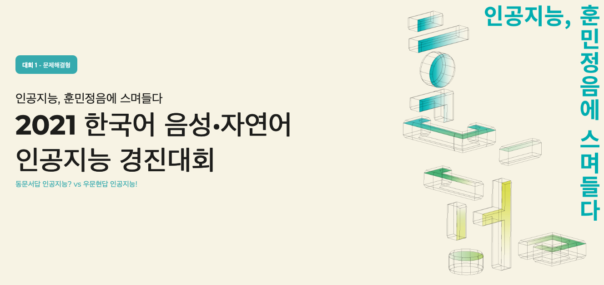
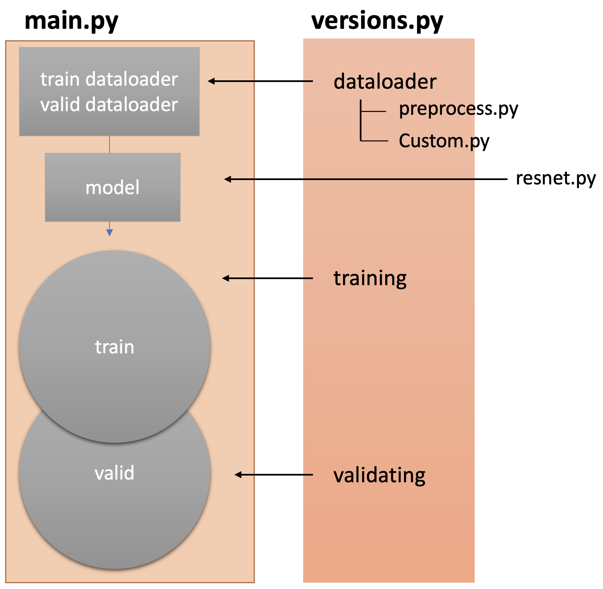
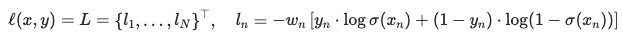
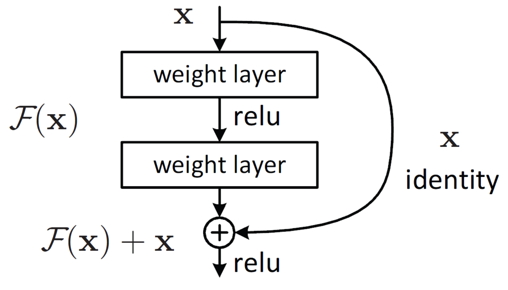
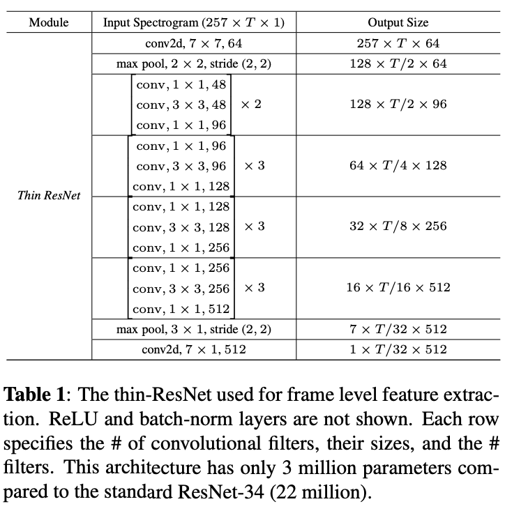
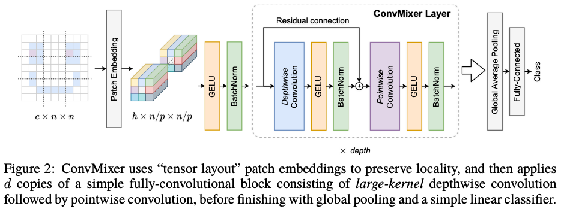

# 2021 Speaker Recognition

주최 : 과학기술정보통신부
주관 : NIA 한국지능정보사회진흥원
운영 : Dacon
후원 : Naver, KT
대회일정

| 일정        | 내용 | 기타           | 결과 |
| ----------- | ---- | -------------- | ---: |
| 9월말       | 예선 | 상위 20팀 선발 | 13등 |
| 10.09~10.24 | 본선 | 상위 10팀 선발 |  5등 |
| 11.01~11.30 | 결승 | 수상 6팀       |  9등 |

## Participants

- 2

## Results

- Qualifiers : 13th
- MiddleLeague : 5th
- FinalLeague : 9th

# Summary of Final League

## Methods

** Shape of DataFrame **

| idx | wav path | speaker id |
| --- | -------- | ---------: |
| 1   | 1.wav    |          1 |
| 2   | 2.wav    |          1 |
| 3   | 3.wav    |          2 |
| 4   | 4.wav    |          4 |

...

## Overview

> We hit the wall at Final League since it's my first time to handle voice data. We tried serveral methods to get lower Loss. Here's our trials.

### Method 1 : siamese model

> Firstly, We got 5th rank on MiddleLeague by constructing siamese model. As a input, we bound two Speakers as a set. To avoide imbalance of the datasets, we bound half of the dataset as same speaker and others as not.

| idx | left wav | right wav | label |
| --- | -------- | --------- | ----: |
| 1   | 1.wav    | 2.wav     |     0 |
| 2   | 1.wav    | 3.wav     |     1 |
| 3   | 2.wav    | 4.wav     |     1 |

### Method 2 : Speaker alone

> Secondly, We could not get any improvement by using Method 1. So, we dig in more recent papers such as Contrastive loss (Chopra et al. 2005); TripleNet Loss(FaceNet)(Schroff et al. 2015); ArcFace Loss(Deng et al. 2018) to approach different perspectives(representation learning). We tried to represent 480 people to embedding space. Unlike Method 1, one speaker is fid to model as an input.

| idx | wav path | speaker id |
| --- | -------- | ---------: |
| 1   | 1.wav    |          1 |
| 2   | 2.wav    |          1 |

## Agumentation(Randomly Choosed)

> Retracing Final League, I guess Agumentation is the key for the winning. Final League dataset were 5 times less than Middle League. However We didn't get any clue at that moment.

- AddGaussianNoise
- TimeStretch
- PitchShift
- Shift
- reverse

## Loss Function

### BCEWITHLOGITSLOSS with Method 1

This loss combines a Sigmoid layer and the BCELoss in one single class. \
This version is more numerically stable than using a plain Sigmoid followed by a BCELoss.

$$ L = -(y_i * log\sigma(y') + (1-y_i)*log(1-\sigma(y')) $$ 

where sigma is Sigmoid

---

#### Constrasive Loss with Method 2

 $$ L = 1/2((1-y)_D^2 + y_(max(0, m-D))^2 $$ 

---

#### Triplet Loss with Method 2

 $$ L = max(d(a,p)-d(a,n)+margin, 0) $$ 

(a,p,n) is parameter which means (anchor, positive, negative) respectively

---

### angleproto with Method 2

---

## Model

> To get some improvement, we tried veriaty of models.

---

### ResNet34

---

### thin-ResNet with SEBlock

---

### patch is all you need

---

## Optimizer

RAdam

---

## Mixed Precision is Used

Mixed Precision of amp make float32 as float16 to accelerate casting such as Linear, Conv layer, etc.

---

## requirement

torch_optimizer
torch == 1.10.0
torchaudio == 0.10.0
pytorch-metric-learning
faiss-gpu
soundfile
scipy
audiomentations

## HardWare

- Naver clova NSML
- NVIDIA TITAN 32G
